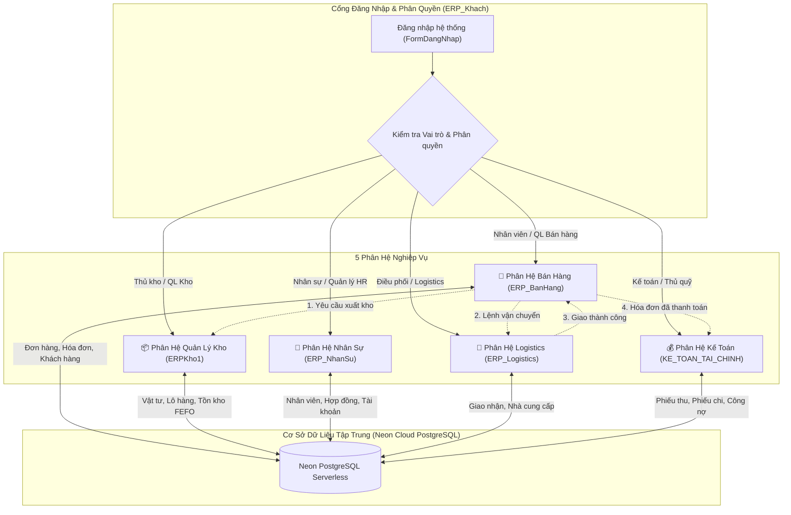

# HỆ THỐNG QUẢN TRỊ DOANH NGHIỆP TOÀN DIỆN - ACECOOK ERP
> **Dự án đồ án môn học ERP (Enterprise Resource Planning)**  
> Tích hợp 5 phân hệ cốt lõi quản trị doanh nghiệp sản xuất thực phẩm, kết nối cơ sở dữ liệu điện toán đám mây **Neon PostgreSQL**, hỗ trợ cài đặt tự động qua **ClickOnce** và chế độ **Portable**.

---

## 📌 MỤC LỤC
1. [Giới Thiệu Tổng Quan](#-giới-thiệu-tổng-quan)
2. [Kiến Trúc & Công Nghệ](#-kiến-trúc--công-nghệ)
3. [Cấu Trúc 5 Phân Hệ Cốt Lõi](#-cấu-trúc-5-phân-hệ-cốt-lõi)
4. [Sơ Đồ Luồng Hoạt Động](#-sơ-đồ-luồng-hoạt-động)
5. [Cấu Trúc Thư Mục Repository](#-cấu-trúc-thư-mục-repository)
6. [Hướng Dẫn Cài Đặt & Sử Dụng](#-hướng-dẫn-cài-đặt--sử-dụng)
7. [Cấu Hình Cơ Sở Dữ Liệu Neon Cloud](#-cấu-hình-cơ-sở-dữ-liệu-neon-cloud)
8. [Các Tính Năng Nổi Bật Đã Chuẩn Hóa](#-các-tính-năng-nổi-bật-đã-chuẩn-hóa)
9. [Đóng Gói & Tự Động Hóa](#-đóng-gói--tự-động-hóa)

---

## 🌟 GIỚI THIỆU TỔNG QUAN

Hệ thống **Acecook ERP** được thiết kế nhằm mô phỏng và quản lý toàn diện chuỗi cung ứng – sản xuất – phân phối của doanh nghiệp sản xuất mì ăn liền quy mô lớn (mô hình Công ty Cổ phần Acecook Việt Nam).

Hệ thống kết nối tập trung 5 phân hệ nghiệp vụ vào một cơ sở dữ liệu đám mây duy nhất trên **Neon PostgreSQL**, đảm bảo tính đồng bộ dữ liệu thời gian thực giữa Bán hàng, Kho, Nhân sự, Logistics và Kế toán.

---

## 💻 KIẾN TRÚC & CÔNG NGHỆ

- **Ngôn ngữ phát triển:** C# (.NET Framework 4.8)
- **Giao diện người dùng:** Windows Forms (WinForms) với thiết kế Flat UI hiện đại, màu sắc chủ đạo Crimson Acecook
- **Cơ sở dữ liệu:** **Neon PostgreSQL** (Serverless Cloud Database)
- **Thư viện truy cập CSDL:** `Npgsql 4.1.12` (hỗ trợ TLS 1.2, Connection Pooling, Auto Reconnect & Timeout Resilience)
- **Báo cáo & Thống kê:**
  - `iText 7 / iText 9`: Xuất báo cáo nhân sự, bảng lương và hóa đơn chuẩn PDF
  - `EPPlus 7.x / 8.x`: Xuất dữ liệu thống kê, doanh thu và kiểm kê ra Microsoft Excel
- **Kiến trúc ứng dụng:**
  - Mô hình phân lớp chuẩn: **GUI** (Giao diện) - **BLL** (Nghiệp vụ) - **DAL** (Truy xuất CSDL) - **DTO** (Đối tượng dữ liệu)
  - Hỗ trợ cả 2 chế độ khởi chạy:
    1. **Master Portal tổng thể (`ERP_Khach`)**: Đăng nhập 1 lần, phân quyền theo vai trò (Role-based Access Control - RBAC) và điều phối mở các phân hệ tương ứng.
    2. **Standalone mode**: Chạy độc lập từng phân hệ cho máy trạm chuyên dụng.
- **Cơ chế phân phối:** Bộ cài chuẩn Microsoft ClickOnce (hỗ trợ `setup.exe` cài đặt 1-click và tự động cập nhật phiên bản).

---

## 🏢 CẤU TRÚC 5 PHÂN HỆ CỐT LÕI

### 1. 🛒 Phân Hệ Quản Lý Bán Hàng (`ERP_BanHang`)
- **Quản lý đơn hàng:** Tạo đơn hàng mới, tra cứu đơn hàng, tính toán tự động tổng tiền và thuế VAT.
- **Hóa đơn điện tử:** Xem chi tiết hóa đơn, kiểm tra trạng thái thanh toán, khóa nút xuất file PDF nếu đơn chưa hoàn tất thanh toán để chống thất thoát.
- **Điều phối vận chuyển:** Tự động đồng bộ đơn hàng sang bộ phận giao vận (`CapNhatTrangThaiGiaoCSDL`) và cập nhật ngược trạng thái hóa đơn khi giao hàng thành công.
- **Báo cáo & Thống kê:** Thẻ KPI tổng quan theo khoảng thời gian tùy chọn (Từ ngày - Đến ngày), biểu đồ doanh thu theo mặt hàng.
- **Chăm sóc sau bán hàng:** Tiếp nhận và xử lý yêu cầu đổi trả, khiếu nại sản phẩm lỗi (`XulyHangLoi`).
- **Auto-Reload thông minh (10s):** Tự động tải lại dữ liệu ngầm kèm nút làm mới thủ công, tùy chọn bật/tắt, nhãn thời gian cập nhật, giữ nguyên dòng đang chọn và vị trí cuộn chuột, bảo vệ thao tác người dùng.

### 2. 📦 Phân Hệ Quản Lý Kho Hàng (`ERPKho1`)
- **Tra cứu tồn kho thời gian thực:** Tìm kiếm thông minh theo mã vật tư, tên vật tư, tên kho bằng cú pháp chuẩn PostgreSQL (`COALESCE`, `ILIKE`).
- **Xuất nhập kho theo nguyên tắc FEFO (First-Expired, First-Out):** Ưu tiên xuất các lô hàng có hạn sử dụng gần nhất.
- **Tự động hóa vị trí kệ kho:** Tự động trừ tồn kho theo lô/vị trí và giải phóng trạng thái kệ lưu trữ thành `"Trống"` khi hàng hóa xuất hết.
- **Bảo mật & Phân quyền:** Kiểm tra quyền vai trò người dùng (`KiemTraQuyenTraCuu`) cho từng hành vi; hỗ trợ form đăng nhập độc lập `FrDangNhap`.

### 3. 👥 Phân Hệ Quản Trị Nhân Sự (`ERP_NhanSu`)
- **Dashboard Tổng quan:** Hiển thị tức thì số lượng nhân sự, số phòng ban, hợp đồng đang hiệu lực và hợp đồng sắp hết hạn ngay khi mở ứng dụng.
- **Quản lý hồ sơ nhân viên:** Thêm mới, chỉnh sửa thông tin, hồ sơ bằng cấp, bảo hiểm xã hội.
- **Quản lý hợp đồng lao động:** Theo dõi hợp đồng thử việc, chính thức, thời hạn hợp đồng và gia hạn hợp đồng.
- **Báo cáo thống kê:** Xuất báo cáo nhân sự định dạng PDF chuyên nghiệp có chữ ký điện tử.
- **Quản trị tài khoản:** Cấp tài khoản hệ thống, đổi mật khẩu và phân quyền vai trò.

### 4. 🚚 Phân Hệ Vận Chuyển & Logistics (`ERP_Logistics`)
- **Quản lý nhà cung cấp:** Danh bạ đối tác cung ứng nguyên phụ liệu (bột mì, gia vị, bao bì).
- **Điều phối giao hàng:** Tiếp nhận danh sách đơn hàng cần giao từ phân hệ Bán hàng, chỉ định tài xế, quản lý biển số xe và cập nhật trạng thái vận chuyển ("Chờ giao" ➔ "Đang giao" ➔ "Đã giao").

### 5. 💰 Phân Hệ Kế Toán - Tài Chính (`KE_TOAN_TAI_CHINH`)
- **Quản lý sổ quỹ:** Lập và phê duyệt phiếu thu (tiền bán hàng, công nợ thu), phiếu chi (mua nguyên liệu, chi lương, phí vận hành).
- **Đối soát công nợ:** Theo dõi công nợ khách hàng và nhà cung cấp, cảnh báo nợ quá hạn.
- **Báo cáo tài chính:** Thống kê dòng tiền, doanh thu thuần, chi phí và lợi nhuận gộp theo từng kỳ kế toán.

---

## 🔄 SƠ ĐỒ LUỒNG HOẠT ĐỘNG



---

## 📂 CẤU TRÚC THƯ MỤC REPOSITORY

```text
ERP/
├── ERP.sln                               # Solution Visual Studio tổng hợp cả 6 dự án
├── nuget.config                          # Cấu hình nguồn khôi phục gói NuGet
├── Directory.Build.targets               # Target MSBuild tự động hóa biên dịch
│
├── ERP_BanHang/
│   ├── ERP_BanHang/                      # Mã nguồn phân hệ Quản lý Bán hàng
│   │   ├── BaoCaoThongKe.cs              # Báo cáo doanh thu, KPI lọc theo ngày
│   │   ├── ChiTietHoaDon.cs              # Chi tiết hóa đơn, bảo vệ xuất PDF
│   │   ├── QlyDonHang.cs                 # Quản lý đơn hàng, xem hóa đơn
│   │   ├── QlyGiaoHang.cs                # Quản lý giao nhận, đồng bộ vận chuyển
│   │   ├── QlyKhachHang.cs               # Quản lý khách hàng (Auto Reload)
│   │   ├── QlySanPham.cs                 # Quản lý sản phẩm (Auto Reload)
│   │   └── XulyHangLoi.cs                # Xử lý hàng lỗi, khiếu nại (Auto Reload)
│   │
│   └── ERP_Khach/                        # Master Portal đăng nhập tổng thể
│       ├── FormDangNhap.cs               # Form xác thực tài khoản & phân quyền
│       └── LogInPhanHe.cs                # Menu lựa chọn phân hệ điều hướng
│
├── ERPKho1/                              # Mã nguồn phân hệ Quản lý Kho
│   ├── FrTraCuuTonKho.cs                 # Tra cứu tồn kho (PostgreSQL chuẩn hóa)
│   ├── FrXacNhanXuatKho.cs               # Xác nhận xuất kho trừ tồn kho FEFO
│   ├── FrDangNhap.cs                     # Đăng nhập độc lập phân hệ kho
│   └── FrMain.cs                         # Giao diện chính phân hệ kho
│
├── ERP_NhanSu/                           # Mã nguồn phân hệ Quản lý Nhân sự
│   ├── GUI/FormMain.cs                   # Giao diện chính nhân sự (SwitchView)
│   ├── GUI/UserControls/ucDashboard.cs   # Thẻ KPI tổng quan (Auto-Load)
│   ├── GUI/UserControls/ucBaoCao.cs      # Lập & xuất báo cáo PDF (iText)
│   └── DAL/DatabaseHelper.cs             # Kết nối Neon Cloud có retry an toàn
│
├── ERP_Logistics/                        # Mã nguồn phân hệ Logistics & Cung ứng
│   ├── frmQuanLyNhaCungCap.cs            # Quản lý danh mục nhà cung cấp
│   └── frmQuanLyVanChuyen.cs             # Quản lý đơn vị và lộ trình giao vận
│
├── KE_TOAN_TAI_CHINH/                    # Mã nguồn phân hệ Kế toán - Tài chính
│   ├── Forms/MainForm.cs                 # Bảng điều khiển tài chính
│   └── Services/                         # Thu, Chi, Công nợ, Đối chiếu
│
├── All/                                  # BỘ CÀI ĐẶT CLICKONCE PHÂN PHỐI HOÀN CHỈNH
│   ├── setup.exe                         # Trình cài đặt tự động ClickOnce 1-Click
│   ├── ERP_Khach.application             # Manifest khởi chạy Master Portal
│   ├── ERP_BanHang.application           # Manifest khởi chạy Bán hàng
│   ├── ERPKho1.application               # Manifest khởi chạy Quản lý kho
│   ├── ERP_NhanSu.application            # Manifest khởi chạy Nhân sự
│   ├── ERP_Logistics.application         # Manifest khởi chạy Logistics
│   ├── KE_TOAN_TAI_CHINH.application     # Manifest khởi chạy Kế toán
│   ├── Application Files/                # Dữ liệu binary cài đặt mã hóa SHA-256
│   ├── All.zip                           # File nén bộ cài ClickOnce (~23 MB)
│   └── All.rar                           # File nén WinRAR bộ cài ClickOnce (~20 MB)
│
└── scripts/                              # Kịch bản tự động hóa đóng gói ClickOnce
    ├── build_all_clickonce.ps1           # Script tạo Manifest và tính Digest SHA-256
    ├── compress_all.ps1                  # Script nén All.zip và All.rar
    └── compress_release.ps1              # Script nén HeThong_ERP_Release.zip
```

---

## 🚀 HƯỚNG DẪN CÀI ĐẶT & SỬ DỤNG

### Cách 1: Cài đặt nhanh qua ClickOnce (Khuyên dùng cho người dùng cuối)
1. Tải về thư mục **`All/`** hoặc giải nén file **`All/All.zip`** (hoặc `All.rar`).
2. Nhấp đúp vào file **`setup.exe`** (hoặc chạy trực tiếp file `.application` của phân hệ muốn mở, ví dụ `ERP_Khach.application`).
3. Trình cài đặt ClickOnce sẽ tự động kiểm tra môi trường, tải các file phụ thuộc và tạo Shortcut khởi động trên Desktop / Start Menu.

### Cách 2: Chạy trực tiếp bản Portable (Không cần cài đặt)
1. Mở thư mục `Goi_Cai_Dat_ERP/` hoặc giải nén `HeThong_ERP_Release.zip`.
2. Khởi chạy file **`ERP_Khach.exe`** để vào Master Portal, hoặc chạy trực tiếp file `.exe` của phân hệ cần dùng (`ERP_BanHang.exe`, `ERPKho1.exe`, `ERP_NhanSu.exe`, `ERP_Logistics.exe`, `KE_TOAN_TAI_CHINH.exe`).

### Cách 3: Mở mã nguồn và biên dịch bằng Visual Studio
1. Yêu cầu môi trường:
   - **Visual Studio 2019 / 2022** (cài đặt workload *.NET desktop development*).
   - **.NET Framework 4.8 Developer Pack**.
2. Mở file **`ERP.sln`**.
3. Visual Studio sẽ tự động khôi phục (restore) toàn bộ gói thư viện NuGet thông qua `nuget.config`.
4. Chọn cấu hình **`Release`** | **`Any CPU`** và nhấn **`Build Solution`** (hoặc phím tắt `Ctrl + Shift + B`).
5. Nhấn **`F5`** để khởi chạy chế độ Debug/Run.

---

## ⚙️ CẤU HÌNH CƠ SỞ DỮ LIỆU NEON CLOUD

Hệ thống sử dụng cơ sở dữ liệu **PostgreSQL** lưu trữ trên nền tảng điện toán đám mây **Neon**. Chuỗi kết nối được thiết lập trong thẻ `<connectionStrings>` của các file `App.config`:

```xml
<connectionStrings>
  <add name="ERP_Connection" 
       connectionString="Host=ep-bitter-heart-b3yu3xlc-pooler.c-4.ap-southeast-1.aws.neon.tech;Port=5432;Database=erp_banhang;Username=neondb_owner;Password=YOUR_PASSWORD;SSL Mode=Require;Trust Server Certificate=true;Timeout=30;Command Timeout=30;KeepAlive=30;" 
       providerName="Npgsql" />
</connectionStrings>
```

> **Lưu ý:** Tất cả các truy vấn SQL đã được chuẩn hóa tương thích hoàn toàn với PostgreSQL:
> - Sử dụng `COALESCE(col, default)` thay cho `ISNULL(col, default)`.
> - Sử dụng `ILIKE` thay cho `LIKE` khi tìm kiếm chuỗi không phân biệt hoa thường.
> - Sử dụng `CURRENT_TIMESTAMP` thay cho `GETDATE()`.
> - Ép kiểu an toàn bằng `CAST(@param AS INT)` khi thao tác tính toán số lượng tồn kho.

---

## 💡 CÁC TÍNH NĂNG NỔI BẬT ĐÃ CHUẨN HÓA

| Tính năng | Chi tiết kỹ thuật | Giá trị mang lại |
| :--- | :--- | :--- |
| **Auto-Reload 10s Bán hàng** | Bộ đếm `Timer` (10.000 ms) chạy ngầm trên cả 6 màn hình bán hàng. Tự động kiểm tra tiêu điểm (`Focused`) và trạng thái nhấn chuột (`MouseButtons`) để không ngắt quãng người dùng đang nhập liệu. | Luôn cập nhật số liệu mới nhất mà người dùng không bị mất dòng đang chọn hoặc vị trí cuộn chuột. |
| **Bảo vệ Xuất Hóa Đơn** | Đổi nút thao tác thành "Xem hóa đơn" cho phép tra cứu trước; khóa nút "Xuất PDF" trong form hóa đơn kèm Tooltip cảnh báo nếu đơn chưa thanh toán. | Ngăn chặn rủi ro xuất khống hóa đơn GTGT khi khách hàng chưa chuyển khoản/thanh toán. |
| **Đồng bộ Giao vận Transaction** | `CapNhatTrangThaiGiaoCSDL` sử dụng `NpgsqlTransaction` cập nhật đồng thời bảng `Giaohang` và cập nhật hóa đơn sang `Đã thanh toán` khi giao hàng thành công. | Đảm bảo tính toàn vẹn dữ liệu (ACID) giữa Bán hàng, Giao nhận và Kế toán. |
| **Quản lý Kho FEFO & Giải phóng kệ** | Tự động trừ tồn kho theo thứ tự hết hạn trước xuất trước (FEFO) và tự động cập nhật trạng thái vị trí kệ sang `Trống` khi số lượng về 0. | Tối ưu hóa không gian lưu trữ kho và giảm thiểu thất thoát do nguyên vật liệu quá hạn. |
| **ClickOnce Chữ Ký SHA-256** | Tất cả file manifest (`.manifest`, `.application`) được tính toán mã băm SHA-256 chuẩn hóa UTF-8 No BOM, loại trừ Win32 Manifest xung đột. | Vượt qua 100% các bài kiểm tra bảo mật của Windows và `InPlaceHostingManager`. |

---

## 📦 ĐÓNG GÓI & TỰ ĐỘNG HÓA

Trong thư mục `scripts/` cung cấp sẵn các script PowerShell phục vụ tự động hóa chu trình CI/CD:
- **`build_all_clickonce.ps1`**: Quét toàn bộ binary đã build, tự động tạo manifest cho cả 6 phân hệ, tính toán kích thước, chữ ký SHA-256 và sinh file `.application`.
- **`compress_all.ps1`**: Đóng gói thư mục cài đặt thành `All.zip` và `All.rar` tối ưu dung lượng.
- **`compress_release.ps1`**: Đóng gói bản Portable thành `HeThong_ERP_Release.zip`.

---

## 👨‍💻 BẢN QUYỀN & TÁC GIẢ
- **Đồ án môn học:** Hệ Thống Quản Trị Doanh Nghiệp (ERP)
- **Kho lưu trữ chính thức:** [https://github.com/Iamfish00/ERP](https://github.com/Iamfish00/ERP)
- **Phiên bản:** `1.0.0.4` (Production Release)
